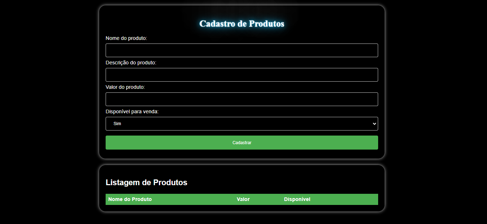

# Projeto de Cadastro e Listagem de Produtos



Este projeto foi desenvolvido como parte do teste para a vaga de estágio na OakTecnologia. O objetivo é criar um formulário de cadastro de produtos e uma listagem ordenada por valor.

## Cadastro de Produtos

### Campos do Formulário:

- **Nome do Produto:** Campo de texto para inserir o nome do produto.
- **Descrição do Produto:** Campo de texto para inserir uma breve descrição do produto.
- **Valor do Produto:** Campo numérico para inserir o valor do produto.
- **Disponível para Venda:** Campo com duas opções: "Sim" ou "Não".

## Listagem de Produtos

- A listagem exibirá os produtos cadastrados em duas colunas:
  - **Nome:** Nome do produto.
  - **Valor:** Valor do produto.
- Os produtos serão ordenados por valor, do menor para o maior.
- Ao cadastrar um novo produto, a listagem será atualizada automaticamente.

## Tecnologias Utilizadas

- **HTML:** Linguagem de marcação para estruturar o conteúdo da página.
- **CSS:** Linguagem de estilização para definir o layout e a aparência visual.
- **JavaScript:** Linguagem de programação para adicionar interatividade e funcionalidades dinâmicas.

## Como Executar o Projeto

1. Clone este repositório:

   ```bash
   git clone https://github.com/felipeand7/cadastraProduto-OakTecnologia
   cd nome-do-repositorio

   ```

2. Clone este repositório:

   ```bash
   npm install

   ```

3. Clone este repositório:

   ```bash
   npm run dev
   ```
